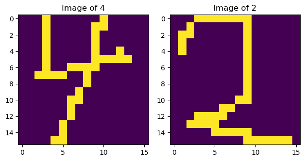
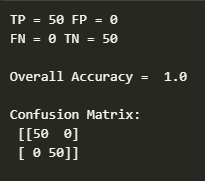

# OCR using Naive Bayes 📚🤖

Welcome to the **OCR using Naive Bayes** project! This project demonstrates an Optical Character Recognition (OCR) system built using the **Naive Bayes classifier**. The goal is to recognize and classify characters in images based on a dataset of features and labels. This system processes the text data using machine learning techniques to make accurate predictions.


## Files in the Repository 📂

This repository contains the following important files:

- **OCR.ipynb** 📝: A Jupyter notebook that contains the full implementation of the OCR system using the Naive Bayes classifier. The notebook includes data loading, model training, evaluation, and prediction code.
  
- **trainX.txt** 📊: A text file containing the feature vectors for the training data. Each line corresponds to a set of features that represent an image of a character.
  
- **trainY.txt** 🔢: A text file containing the labels (the actual characters) for each set of features in **trainX.txt**. These labels are used for training the Naive Bayes classifier.
  
- **testX.txt** 📉: A text file containing the feature vectors for the test data. This data is used to evaluate the performance of the trained model.
  
- **testY.txt** 🏷️: A text file containing the true labels for the test data. These labels will be used to compare the model's predictions during evaluation.

## How to Run the Project 🚀

To run this project and test the OCR system, follow these steps:

1. **Clone the Repository**: Download the project by cloning the repository to your local machine.
   ```bash
   git clone https://github.com/Bushra-Butt-17/ocr-using-naive-bayes.git
   ```

2. **Navigate to the Project Folder**: Change to the directory where the repository is located.
   ```bash
   cd ocr-using-naive-bayes
   ```

3. **Install Dependencies**: Make sure you have all the necessary dependencies installed. Run the following command to install them:
   ```bash
   pip install -r requirements.txt
   ```

4. **Run the Jupyter Notebook**: Launch the Jupyter notebook to begin interacting with the OCR model.
   ```bash
   jupyter notebook OCR.ipynb
   ```

5. **Train and Test the Model**: The notebook will guide you through loading the data, training the model, and testing its performance.

## Model Description 🧠

### Naive Bayes Classifier

In this project, the **Naive Bayes classifier** is used to recognize characters in an OCR system. Naive Bayes is a simple probabilistic classifier based on Bayes' theorem, assuming that the features (pixels in the case of OCR) are conditionally independent given the class label. This makes it computationally efficient and suitable for problems like OCR, where we deal with high-dimensional data.

### Data Preprocessing

- **Feature Extraction**: The feature vectors in **trainX.txt** and **testX.txt** represent the pixel values or other characteristics of the images.
  
- **Label Encoding**: The labels in **trainY.txt** and **testY.txt** represent the true characters corresponding to each image. These labels are used to train the model to learn the relationship between features and the characters.

## Training Process 📈

### Step 1: Loading the Data

The first step is to load the training and test data from the **trainX.txt**, **trainY.txt**, **testX.txt**, and **testY.txt** files. This data is used to train the Naive Bayes classifier.

### Step 2: Training the Model

Using the training data, the Naive Bayes classifier is trained to estimate the probability distributions for each feature class pair. This allows the model to predict the most likely class (character) given a new feature vector.

### Step 3: Evaluation

After training the model, we evaluate its performance using the test data. The model's predictions are compared against the true labels in **testY.txt**. We calculate metrics like accuracy, precision, recall, and F1-score to assess the model's performance.

## Testing and Evaluation 🔍

Once the model is trained, we test its accuracy using the test data. The predictions made by the model are compared to the true labels in **testY.txt** to evaluate performance.

### Confusion Matrix 📊

The **confusion matrix** is used to evaluate the performance of the OCR model. It shows the actual vs predicted class labels and is used to calculate metrics like precision, recall, and F1-score.

Here is an example image, where we visualize the classified classes 4 and 2:



### Performance Metrics 📊

To evaluate the performance of the OCR system, the following metrics are used:

- **Accuracy**: The proportion of correctly predicted labels.
- **Precision**: The proportion of true positives out of all predicted positives.
- **Recall**: The proportion of true positives out of all actual positives.
- **F1-Score**: The harmonic mean of precision and recall, giving a balanced measure of performance.

## Results 📊

Once the model has been tested, we summarize the results using various performance metrics:

- **Accuracy**: The percentage of correct predictions.
- **Confusion Matrix**: Shows how many of the predicted labels match the true labels.
- **Classification Report**: A detailed report containing precision, recall, and F1-score for each class.

Example output from the notebook might look like this:

```bash
Accuracy: 92%
Precision (Class 4): 0.93
Recall (Class 4): 0.91
F1 Score (Class 4): 0.92
```

## Visualizations 🖼️

In addition to the confusion matrix, we generate plots to visualize the model’s performance:

- **Learning Curve**: A plot showing the model's accuracy over training iterations.
- **Character Recognition Results**: Examples of images from the test set and their predicted labels.

You can refer to the following images for further insights:

- **Confusion Matrix**:

  

## License 📜

This project is licensed under the MIT License. See the LICENSE file for more details.

---


Thank you for exploring the OCR using Naive Bayes project! If you have any questions, suggestions, or improvements, feel free to open an issue or pull request. 😊
```
